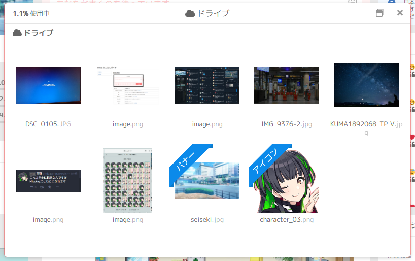

# ドライブ

## 概要
Misskeyに投稿された画像はすべてユーザーごとに確保された一定の領域内に保存されます。これを**ドライブ**といいます。

ドライブ内に保存されたアイテムはいつでも再利用でき、投稿画面の雲のアイコンから選択できます。

## フォルダ分け
ファイルがないところで右クリックすると "フォルダを作成" という項目があります。用途に応じてファイルを整理しておくことが可能です。

このフォルダ分けは見かけ上でありURLは変更されないため、投稿後でもURLをはり直す必要はありません。

## 注意点

twistaでは現時点でユーザーごとのドライブの領域を4GBまでに制限しています。この容量をオーバーすると新たなファイルの保存はできなくなるので、満杯になった時点で要らなくなった画像を削除するなどして空き容量を確保する必要があります。
