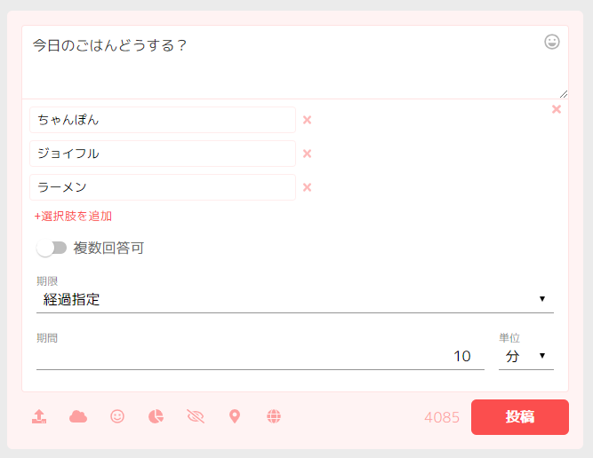

# アンケート

## 概要
その名の通り、アンケートを取ることができます。

複数回答の設定や回答締切を無制限か経過時間か日時で指定できます。

## 使い方
### 設問
設問はいつもの投稿欄に書いてください。

### 選択肢
最低2つの選択肢が必要です。今のところ10個まで指定できます。

### 複数回答の可否
複数回答を許容するならチェックを入れます。

### 期限
アンケートの期限は以下の3つから選ぶことができます。

* 無期限 - 期限を設定しません
* 経過指定 - アンケートを投稿して設定時間がすぎると回答を締め切ります
* 日時指定 - 設定した日付・時間になると回答を締め切ります

