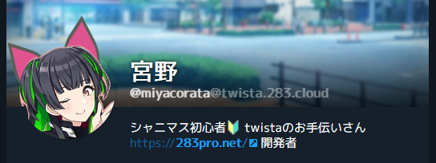

# twista 独自機能

twistaは本家Misskeyにはない独自機能もサポートしています。

独自構文をお探しですか？ → [twista 独自構文](syntax.md)

## 猫の耳の角度


catなプロデューサーの猫耳の角度を調整できます。

設定 > プロフィール から アイコンの角度 で調整できます。これは猫耳に限り有効です。

`18deg`のように単位にdegをつけてください。

こんな感じになります



**ちなみに :** 猫耳の色はアイコンの色の平均値で自動で設定されます

## ｺﾐﾔｶﾎになる
ｺﾐﾔｶﾎになることができます(意味不明)

投稿文が常にkahonize([独自構文を参照](syntax.md))されます。

## 名前のトークン

名前の冒頭に【大石泉すき】みたいな形のテキストを書くとトークン表示になります。

```
【大石泉すき】硫酸鶏
```

一階層だけ入れ子にできますが、トークン判定記号を除いた先頭部分でなければ入れ子表示にはなりません。ただのテキストとして判定されます。

### 入れ子になる表記
```
【[大石泉]すき】
```
大石泉の部分もトークン表示になり、入れ子になります。

### 入れ子にならない表記
```
【大石泉[すき]】
```
`すき` は文頭ではないため、トークン表示にはならず外側のトークンの内部に `大石泉[すき]` と表示されます。

### 背景色・文字色の指定
トークン判定記号の内側先頭にカラーコードを一つ書くと背景色、二つ書くと背景色と文字色を指定できます。

```
【#5abfb7徳川まつり】
```
この場合、トークンの背景色が <span style="color:#5abfb7">#5abfb7</span> になります。

### うらばなし
ちなみに入れ子にできるのはもともと想定されていなかった言わばバグ技でした。
そこから行先表示っぽくできるよねというアホの発想に鯖缶がノリノリで実装した結果この機能が完成しました。

## 名前の＠表示
```
名前@場所
```
名前に@(アットマーク)を含めた場合、@以降の文字列は独自にスタイリングされて表示されます。

例えば、ライブやイベント参加の際や即売会参加の際のスペース表示としての活用が想定されています。
