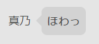

# twista 独自構文

twistaは本家Misskeyにはない独自構文もサポートしています。

独自機能をお探しですか？ → [twista 独自機能](original.md)

MisskeyがサポートするMFM(Misskey Flavored Markdown)はこちら → [文字装飾](https://join.misskey.page/ja/wiki/usage/mfm)

***

## `<nya>` - nyaize構文
catでないプロデューサーでもcatな文書にできます。例えば以下のように使います。
```
<nya>ねこになってみた</nya>
```
これを投稿すると以下のように見えます
> ねこににゃってみた

もし常にcatになりたいなら、設定からcatになることができます。

## `<!nya>` - denyaize構文
catなプロデューサーでも部分的に投稿のnyaizeをキャンセルすることができます。例えば以下のように使います。
```
<!nya>これならねこにならない</!nya>
```
これをcatなプロデューサーが投稿すると以下のように見えます
> これならねこにならない

使い時の例として、catなプロデューサーがSSを投稿する際などに使えます。アイドルが勝手にcatにならなくなります。

## `話者「台詞」` - 吹き出し構文
誰かが何かを喋っているように見せることができます。これは(現時点では)twistaのwebクライアントでのみ動作します。
```
真乃「ほわっ」
```

>

吹き出し構文は上記のように一行が `話者[開き括弧]台詞[閉じ括弧]` である場合にのみ装飾されます。

## `\[任意のテキスト]\` - 明朝構文
任意のテキストを `\`(バックスラッシュ) で囲むとその部分を明朝体で表示します。これは(現時点では)twistaのウェブクライアントでのみ動作します。
```
\決算\
```

## `:@[screenname]:` - アイコン絵文字化構文
任意のプロデューサーのスクリーンネーム(リモートユーザーの場合はサーバアドレスも含む)をコロン `:` で囲む(絵文字コード風に書く)とそのプロデューサーないしユーザーのアイコンを絵文字のように利用できます。これは(現時点では)twistaのウェブクライアントでのみ動作します。
```
:@miyacorata:
```
活用法のひとつとして、吹き出し構文と組み合わせて会話の再現が可能です。

## `<kaho>` - kahonize構文

投稿文がｺﾐﾔｶﾎになります。
```
<kaho>投稿内容が元気になります！！！</kaho>
```

> 投稿内容が元気に゛な゛り゛ま゛ず！！！

常にｺﾐﾔｶﾎでありたい場合、ユーザー設定からｺﾐﾔｶﾎになることができます。

## `<!kaho>` - dekahonize構文

ｺﾐﾔｶﾎなプロデューサーでも~~一時的に冷静になれます~~部分的にkahonizeをキャンセルすることができます。

```
<!kaho>見ない顔ですねぇ...！</!kaho>
```
> 見ない顔ですねぇ...！

## OpenType構文

フォントの仕様を最大限に活用した投稿を作れます <!-- #とは -->

## ルビ構文
```
このような｜構文《シンタックス》を使うことで｜文字《キャラクター》にルビを｜振《あたえら》れます
```

## スタンプ

絵文字1文字単体で投稿するとスタンプになります。(絵文字が大きめに表示されます)
