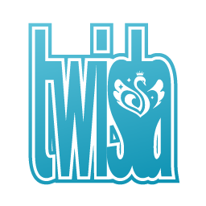

# Welcome to **twista** Help

## twista へようこそ！

twistaを見つけていただき、ありがとうございます。twistaは、アイドルマスターシャイニーカラーズのプロデューサーやファンが集まる[Misskey](https://github.com/syuilo/misskey)インスタンスです。

Fediverse(様々なSNSで構成される宇宙)の中に存在するため、他のSNSと相互に繋がっています。[friends.nico](https://friends.nico)や[Pawoo](https://pawoo.net)、[im@stodon](https://imastodon.net)のプロデューサーとも繋がることができます。

****

## 総合案内
|ページ|内容|
|:--:|:--|
|[かんたんガイド](kantan.md)|とりあえず投稿するならここを読めばOK！|
|[機能一覧](feature/index.md)|いろんな機能を詳しく知りたい方はこちら|
|[お問い合わせ](contact.md)|鯖缶・モデレータへの連絡方法を載せています|

****

## twista Q&A

### twistaって何が元ネタ？
シャニマスの世界でちょこ先輩とかが使っているSNSです。

### Misskeyって何？
[Misskey](https://github.com/syuilo/misskey)とは、Fediverseに対応した分散SNSソフトウェアです。

超わかりやすく言うと、好き勝手建てられるTwitterみたいなものです。しかしTwitterにはない機能をたくさん搭載しています。

### Fediverseって？
Fediverseとは、Federation(連合)とUniverse(宇宙)を組み合わせた造語です。

分散SNSの規格にActivityPubというものがあります。これに対応しているMisskeyやMastodonのインスタンスは相互に投稿やフォロー情報をやりとりし、たとえ異なるサーバ間であってもフォローしあい、投稿を見ることができます。

それぞれのインスタンスが繋がってできた広大なネットワーク、これをFediverseと呼んでいます。

### インスタンスって？
いわゆるサーバーです。日本語圏で著名なサーバとして[friends.nico](https://friends.nico)や[Pawoo](https://pawoo.net)、アイマス系インスタンスとして[im@stodn](https://imastodon.net)などがあります。

### で、結局twistaって？
シャニマスのプロデューサーやファンの方々が集い、ほわぁっとおしゃべりするインスタンスです。

オリジナルのMisskeyにはない独自機能やカスタム絵文字も今後増えるかもしれません。

### シャニマスって？
正式名称を[アイドルマスターシャイニーカラーズ](https://shinycolors.idolmaster.jp)といいます。

283プロダクションに所属するアイドルをプロデュースし、トップアイドルを目指すゲームです。

株式会社BXDが運営するHTML5プラットフォーム「enza」を採用しており、スマホからPCから、どこでもプロデュースができます。

### アイドルマスターって？
**人生**です。

真面目な説明 : THE IDOLM@STER（アイドルマスター）は株式会社バンダイナムコエンターテイメントが製作しているゲーム、またはそのメディアミックスシリーズです。
