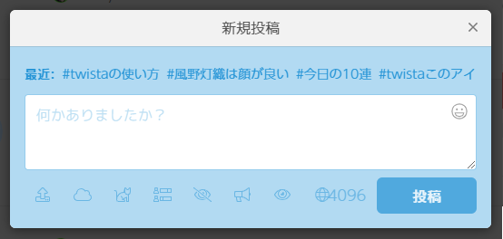
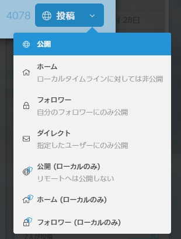

# twista かんたんガイド

## 投稿画面

|アイコン|なにができる？|
|:--:|:--|
||画像などのファイルをアップします → [ドライブ](feature/drive.md)|
||すでにアップロードした画像などを投稿に埋め込めます → [ドライブ](feature/drive.md)|
||ランダムで顔文字が入力されます フグパンチとかできます|
||アンケートができます → [アンケート](feature/enquete.md)|
||内容を隠します ネタバレ防止とかに使えます|
||実況モードにします|
||年齢別の公開範囲を設定します 現状ハリボテです|
||公開範囲を変えられます → [公開範囲](#公開範囲)|

リンクがある項目はリンク先に詳しい説明があります

入力エリア上部には最近使ったハッシュタグが列挙されます。

## 公開範囲
twistaでは投稿を公開する範囲を指定することができます。

|公開範囲|概要|
|:--|:--|
| 公開|ローカルタイムラインに流れます|
| ホーム|ローカルタイムラインには流れません|
| フォロワー|ローカルタイムラインには流れず、フォロワーしか閲覧できません|
| ダイレクト|メンションをつけた人にしか見えません|
| (ローカルのみ)|twistaの外のサーバには投稿が流れません このとき外のサーバのフォロワーも投稿を見ることはできなくなります|
